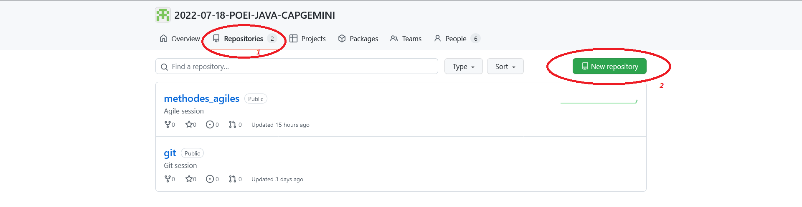

# Commandes

1. Créez un dépôt distant du GitHub

2. Récupérez le dépôt distant en local
- `git clone https://repository-link/repo.git `
3. Créez une nouvelle branche nommé feature/exercises
- `git branch feature/exercices`
- `git checkout -b feature/exercices`
- ou vous pouvez directement faire la commande suivante pour aller plus vite `git checkout -b feature/exercices` 
